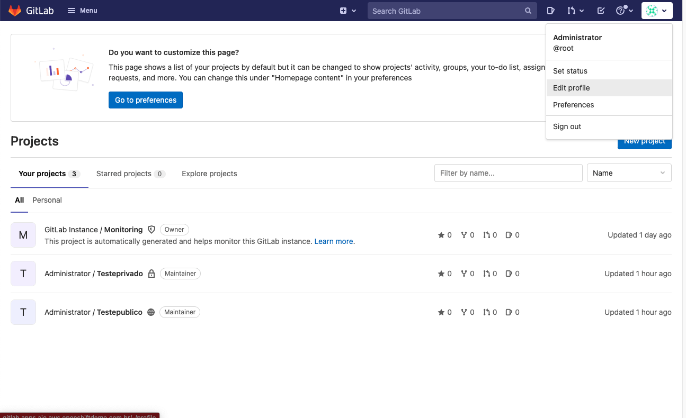
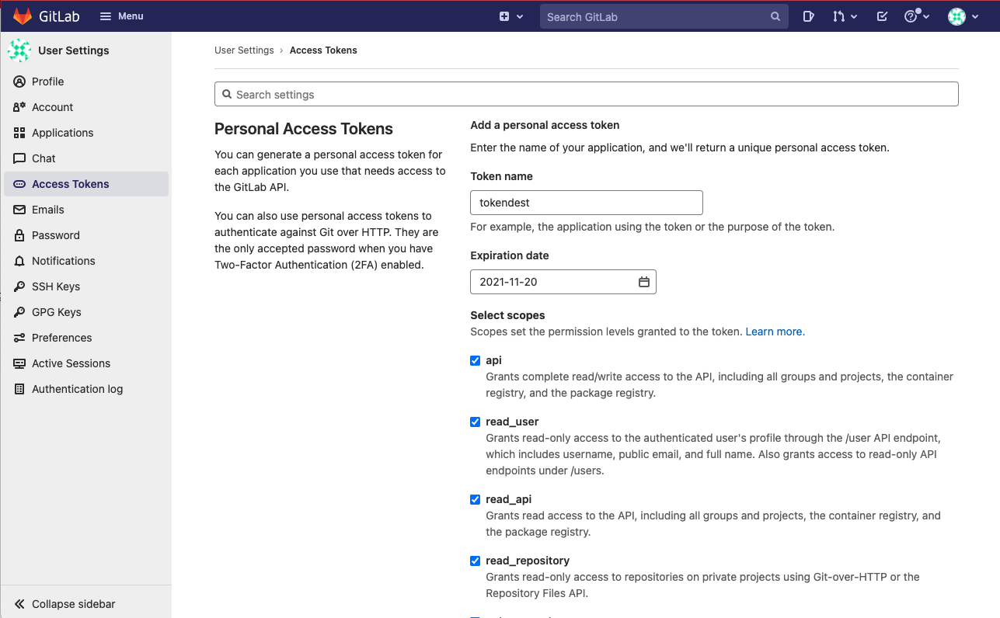

# gitlabsync
Sync between GITLab Repos. 

This playbooks connect to a source GitLab server using API, list all projects and repos and mirror them in an another GitLab destination. It's important to have enough local space to do this. It will use a local "repos" dir in order to mirror the git repositories. We suggest to remove this directory once the sync is done or you could also backup it for later usage, since it has all the commits.

We suggest a fresh new gitlab on destination and, of course, an existant backup.

## Instructions
### 1 - Create a config.yaml file with following content:

 ```
src_git_url: http://gitlab.source.url  
src_access_token: yG1JvnEvYcmHAZPKYx2o  
root_user: root  
dst_git_url: http://gitlab.destination.url  
dst_access_token: qenCxwpyjvrsYCzQpfsz  
  ```

### 2 - Create an administrator user on both Giglabs and obtain a token

Go to Edit Profile -> Access Tokens





You can try to not grant write_repository and sudo repository on the src git. (We have not tested it yet)

### 3 - Fix the playbook if you are using https and if you need to exclude some repos

Maybe you have to change the urls inside the playbook to use https instead of http (in later versions we could to this automatically)

### 4 - Clear the repo dir

``` rm -rf repos/* ```

### 5 - Run the playbook
```ansible-playbook sync_repos.yaml```

## Todo
We guess it is possible to use this playbook to migrate also the issues and other configurations too. The logical is the same.